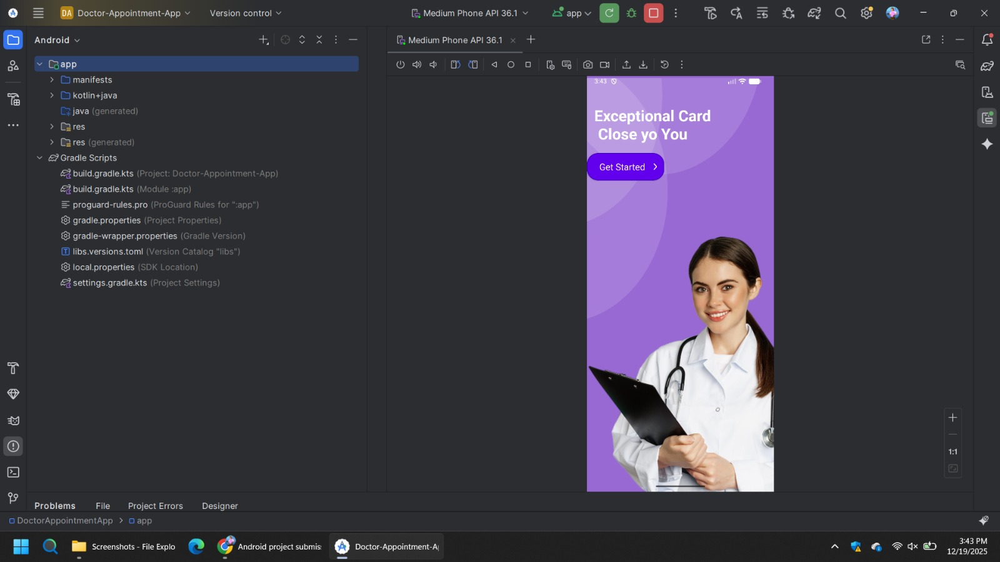
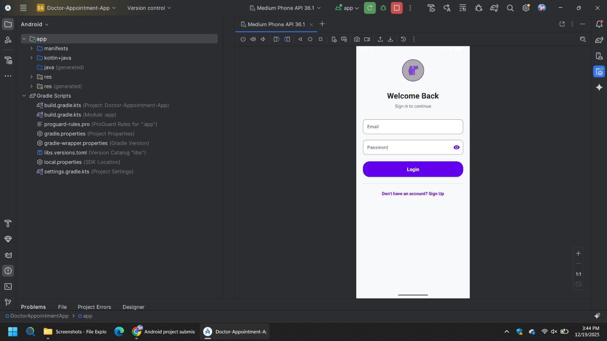
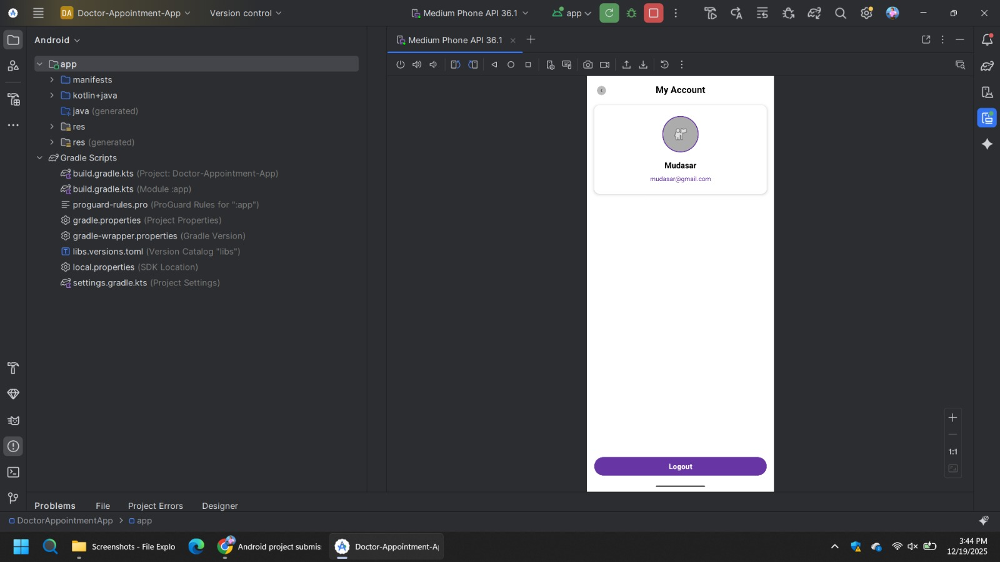
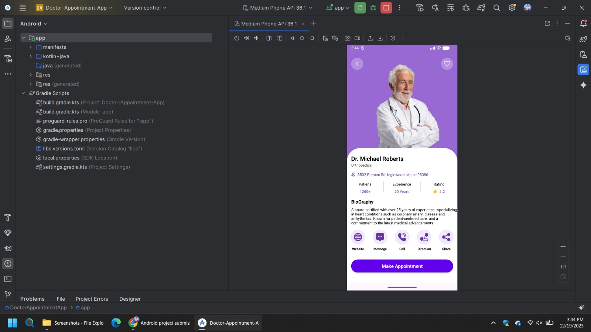
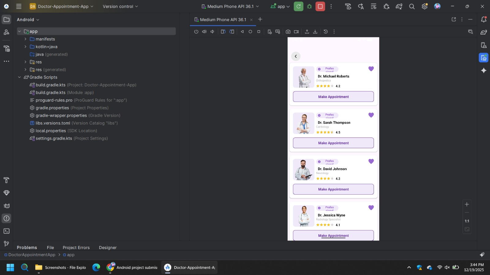
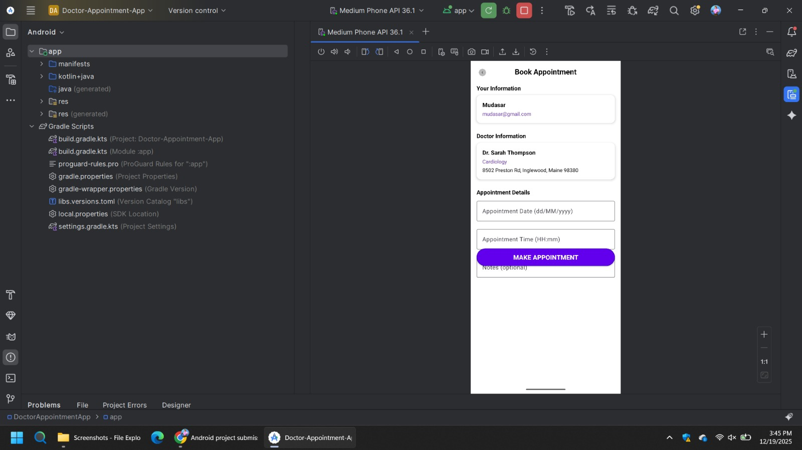
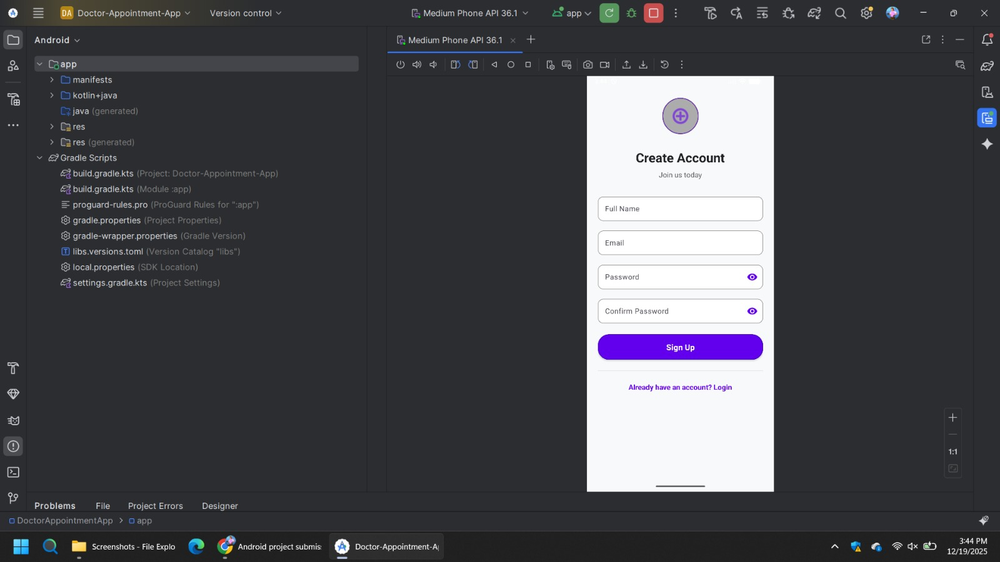

# Doctor Appointment App

## Project Description
The Doctor Appointment App is an Android-based mobile application designed to simplify and automate the process of booking doctor appointments. 
Patients can view available doctors, check schedules, and book appointments easily using their mobile phones.
This app replaces the traditional manual appointment system, saving time and improving healthcare service efficiency.

## Objectives
Provide an easy and efficient way for patients to book doctor appointments  
Manage doctors’ schedules effectively  
Reduce manual and paper-based appointment systems  
Develop a user-friendly Android application  
Improve communication between patients and doctors  

## Problem Statement
Traditional doctor appointment systems are time-consuming and inconvenient. 
Patients face long waiting times, and manual systems are prone to errors. 
The Doctor Appointment App aims to solve these problems by providing a digital platform to manage appointments efficiently.

## Features
User Registration and Login  
Doctor List Display  
Appointment Booking System  
Simple and User-Friendly Interface  

## Screenshot Images

